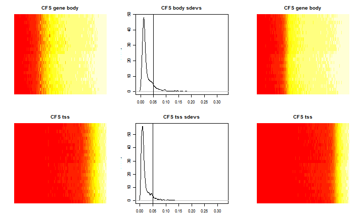
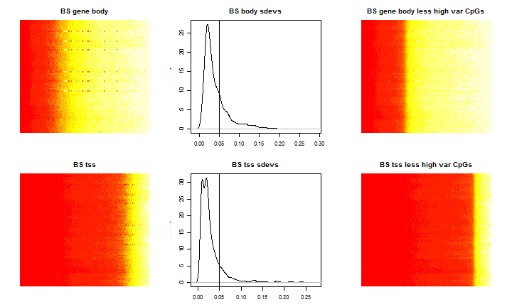

# Selecting Housekeeping Genes for Normalization

### Motivation

One of the main advantages of our procedure is it is invariant to samples containing mixtures of different cell types.  We are able to achieve this by using only a subset of the probes on the whole array that are annotated as belonging to the so-called housekeeping genes.
Before blindly using this list for normalization, we would like to do a quality control check to ensure that they are indeed invariant across samples that are known to have different cell-type mixtures.

For the actively transcribed housekeeping genes, CpGs in the promoter regions should be completely unmethylated in all cell types and will provide a "zero control."  CpGs in gene bodies should be mostly methylated.  When we look at some real data, we will see that this is *mostly* true, with some exceptions that will be removed.

Using both the chronic fatigue data and the BrainSpan data we pull out CpGs annotated to these housekeeping genes and group them as either being proximal to TSS or located in the gene body.

### CFS data

We first look at the chronic fatigue syndrome data. These are PBMC blood samples from 24 individuals and are composed of a mixture of T-cells, monocytes, as well as other immune cells. Using the method described in the Houseman paper for estimating mixture proportions, we have seen that there is a confounding mixture difference between case and controls. That is to say that cases have a relatively higher proportion of CD4 T-cells which agrees with the idea that these CFS patients have overly active immune systems.

In order to test for the consistency of housekeeping CpGs and remove variable probes, we create a heatmap that shows level of methylation on the color axis for all samples.  Each row of the heatmap is a sample and each column corresponds to a CpG.  The CpGs are sorted in order of average beta value with red being close to zero (left side) and white being close to 1 (right side).

We can see that there are some CpGs that are somewhat inconsistent. In the two middle figures, we plot the density of probe standard deviations, and pick a reasonable threshold for discarding highly variable probes.  The new, purified subsets are plotted in the two right figures.  We will take a closer look at these removed variable housekeeping CpGs in a later report.

 

### BrainSpan Data

We next look at the BrainSpan data.  These are 93 samples from 6 individuals from 16 brain regions, with 3 bad samples removed.  Unlike the CFS data, we know which samples should have substantially different mixtures of neurons, astrocytes, oligodenrocytes, and microglia.  In particular, the cerebellum samples should have a relatively higher neuron to astrocyte ratio than the remaining samples.  The subcortical regions should also have slightly different mixtures than the cortical samples, but these differences appear to be much more mild than the mixture difference in CBC.

We again generate the same figure as before for the 93 samples (93 rows) and the same set of housekeeping CpGs arranged by mean methylation along the columns.  We can see from the heatmap which samples belong to cerebellum (there are 6).  Clearly, these cerebellum specific sites need to be removed.  Many of the variable CpG sites removed for final normalization overlapped between the two data sets, but this will be given more detail later.

 

## Selection of CpGs for final normalization

In order to create the final list of housekeeping CpGs to be passed to the normalization function, we take the union of the two subsets of variable probes from the two data sets and remove them from the final list.  This refinement step should help guarantee stable references for several reasons.

* We are refining our list using two different experiments with two completely different cell mixtures
* Both sets of data are known to contain substantially varying cell mixtures across samples
* The CFS data contains 24 individuals and has a good chance of capturing housekeeping CpGs that are variable across individuals as well as tissue mixtures

